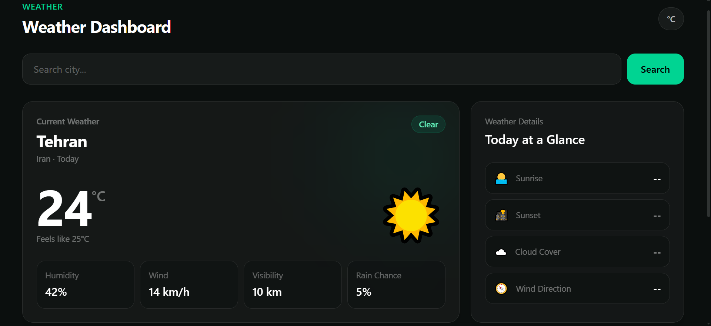

# Weather Dashboard 🌦️

A modern and responsive weather dashboard built with Vanilla JavaScript, Tailwind CSS, Vite, and OpenWeather API.

## 📸 Preview

## 🚀 Live Demo

[**View Live Demo →**](YOUR_LIVE_SITE_URL)

## ✨ Features

- 🌍 Search cities worldwide
- 🌡️ Current temperature & feels like
- 🔄 Celsius / Fahrenheit
- ⏱️ Hourly forecast
- 📅 Daily forecast
- 💧 Humidity
- 💨 Wind speed & direction
- 👁️ Visibility
- 🌧️ Rain probability
- ☁️ Cloud coverage
- 🌅 Sunrise & sunset
- ⚠️ Error handling
- 📱 Responsive design
- 🌙 Modern dark glassmorphism UI

## 🛠️ Built With

- HTML5
- Tailwind CSS
- JavaScript
- Vite
- OpenWeather API
